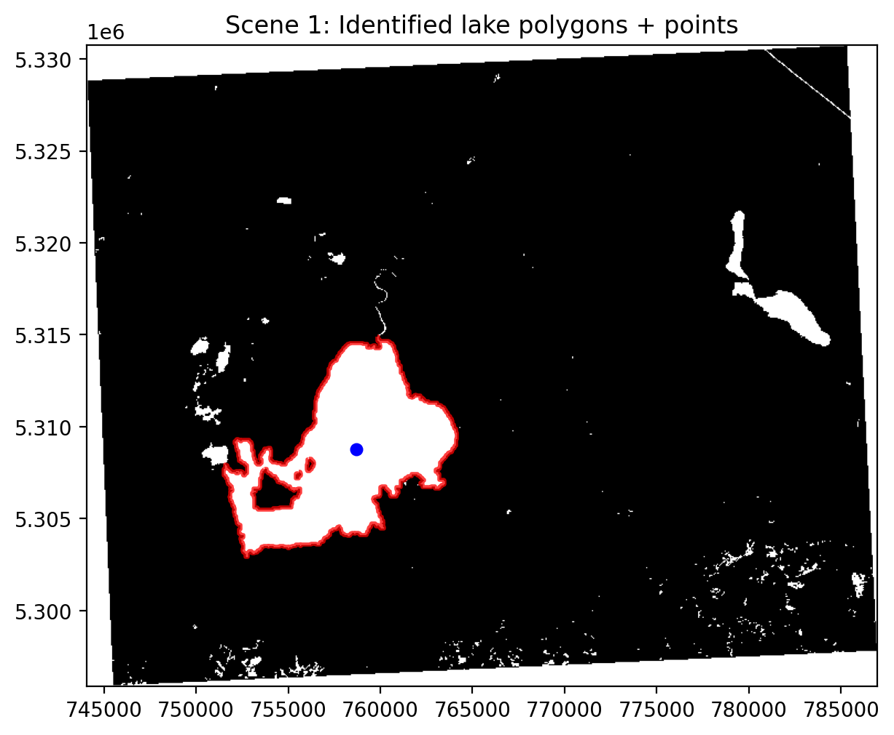
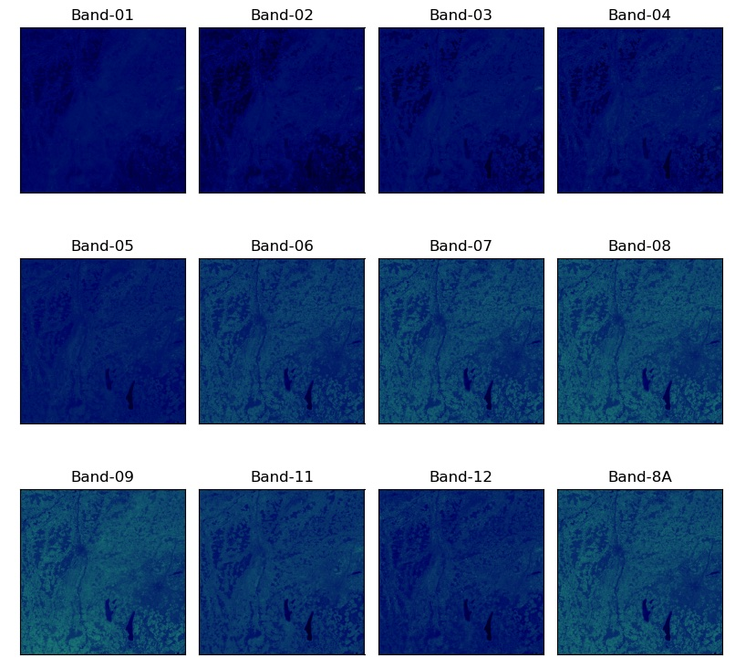
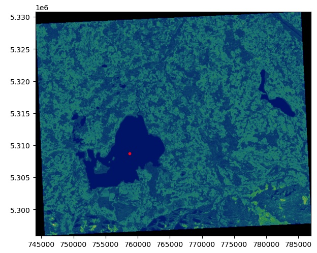
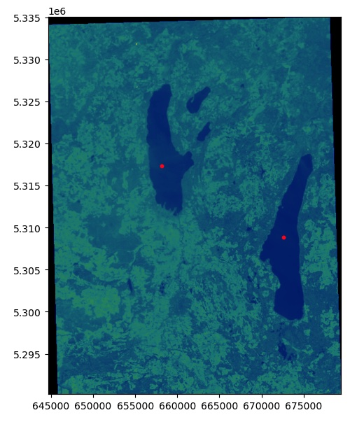
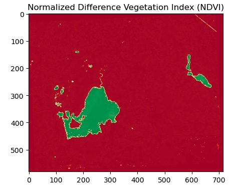
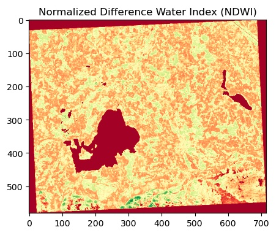
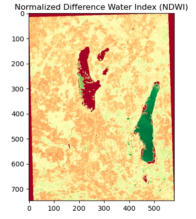
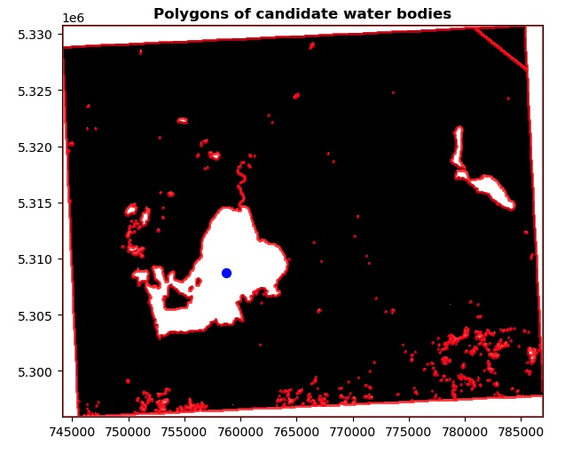
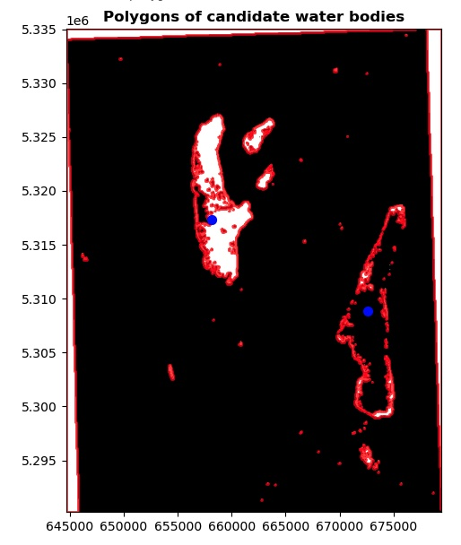

# Open Cosmos Challenge

This my solution to the [Open Cosmos](https://www.open-cosmos.com/) challenge for the *Data Scientist* role, published in February/March 2023.

In the challenge, two scenes captured by Sentinel 2 are provided, along with a Region of Interest (ROI) and a set of target points for each scene. The **objectives** are:

1. Crop all the bands in each scene to their associated ROI.
2. Compute the NDVI and NDWI maps of the cropped bands.
3. Extract the inland water body shapes in the cropped bands.
4. Identify the shapes of the water bodies associated with the provided sets of points and store them in a vectorized format.

The complete set of instructions is in the file [`Data_Scientist_Challenge_Project.pdf`](Data_Scientist_Challenge_Project.pdf).

This figure shows the RGB image of the scene 1 and its final result (objective 4):

<p style="text-align:center">
  
  
</p>

The remainder of this document explains the structure of the repository, how to use it and the reasoning behind the performed analysis to accomplish all objectives for both scenes.

:warning: **Important**: the result files are located in [`results`](results).

## Table of Contents

- [Open Cosmos Challenge](#open-cosmos-challenge)
  - [Table of Contents](#table-of-contents)
  - [How to Use This Project](#how-to-use-this-project)
    - [Installing Dependencies for Custom Environments](#installing-dependencies-for-custom-environments)
  - [Dataset](#dataset)
  - [Notes on the Implemented Analysis](#notes-on-the-implemented-analysis)
    - [Summary and Conclusions](#summary-and-conclusions)
  - [Next Steps, Improvements](#next-steps-improvements)
  - [References, Links and Assets](#references-links-and-assets)
  - [Authorship and Terms of Use](#authorship-and-terms-of-use)

## User Guide

The directory of the project consists of the following files:

```
.
├── Data_Scientist_Challenge_Project.pdf        # Original instructions
├── LICENSE.md
├── README.md                                   # Documentation + report
├── Slides.pdf                                  # Presentation
├── assets/                                     # Images used in the report, etc.
│   └── ...
├── conda.yaml                                  # Conda environment file (better, use requirements.txt)
├── config_test.yaml
├── data                                        # Original dataset
│   ├── Scene 1 ...
│   │   ├── B01_COG.tiff
│   │   ├── ...
│   │   ├── B8A_COG.tiff
│   │   ├── lakes.geojson
│   │   └── processed/                          # Outcomes from processing
│   │       └── ...
│   └── Scene 2 ...
│       ├── B01_COG.tiff
│       ├── ...
│       ├── B8A_COG.tiff
│       ├── lakes.geojson
│       └── processed/                          # Outcomes from processing
│           └── ...
├── geo_processing.log                          # Logs
├── geo_toolkit                                 # Library/package
│   ├── __init__.py
│   ├── geo_library.py
│   └── resample_raster.py
├── notebooks                                   # Research environment notebook
│   └── Geospatial_Image_Analysis.ipynb
├── requirements.txt                            # Environment dependencies
├── results                                     # Final results, taken from data/.../processed
│   ├── scene_1/
│   │   ├── B01_COG.tiff
│   │   ├── ...
│   │   ├── B8A_COG.tiff
│   │   ├── ndvi.tiff
│   │   ├── ndwi.tiff
│   │   ├── scene_1_lake_polygons.geojson
│   │   └── scene_1_lake_polygons.png
│   └── scene_2
│       ├── B01_COG.tiff
│       ├── ...
│       ├── B8A_COG.tiff
│       ├── ndvi.tiff
│       ├── ndwi.tiff
│       ├── scene_2_lake_polygons.geojson
│       └── scene_2_lake_polygons.png
├── setup.py                                    # Package installation file
├── tests                                       # Pytest tests for the package
│   ├── __init__.py
│   ├── conftest.py
│   └── test_geo_library.py
├── utils                                       # Resampling utility script
│   └── resample_raster.py
└── vectorize_water_blobs.py                    # Main application file to use the library
```

The final result files related to the 4 objectives are located in the folder [`results`](./results/); additionally, the present `README.md` contains the documentation of the project as well as the report with the learned insights. Finally, the [`Slides.pdf`](./Slides.pdf) contain the presentation.

After setting up the correct environment, there are two ways of using/running the project:

1. Open the notebook [`Geospatial_Image_Analysis.ipynb`](notebooks/Geospatial_Image_Analysis.ipynb) and execute all cells in sequence. The variable `SCENE` needs to be set at the beginning to run the processing for each of the scenes 1 or 2. The notebook guides the user with comments and text about the followed reasoning.
2. Run the script [`vectorize_water_blobs.py`](vectorize_water_blobs.py) which uses the library [`geo_toolkit`](geo_toolkit) to perform the same processing. The outcome is the same as with the notebook, but in this case the code has been transformed to a production environment following PEP8 conventions, logging, etc. In the script, the `SCENE` needs to be selected, too.

In the following sub-sections, practical commands for setting up the environment and running the application are shown.

### Installing Dependencies for Custom Environments

First, we need to install:

- A python package environment manager, such as [Anaconda/Miniconda](https://docs.conda.io/en/latest/miniconda.html). Alternatively, we can use the default [venv](https://docs.python.org/3/library/venv.html).
- [GDAL](https://gdal.org); a practical guide can be found [here](https://towardsdatascience.com/spatial-data-science-installing-gdal-on-windows-and-macos-6fb5c958dc26).

Then, we need to create a custom environment and install the required dependencies; for instance, a quick recipe which sets everything up with Anaconda is the following:

```bash
# Create an environment and install the dependencies
conda create --name cosmos pip python=3.10
conda activate cosmos
python -m pip install -r requirements.txt
# Install the geo_toolkit library
python -m pip install .
```

List of the most relevant dependencies installed with `requirements.txt` (see versions in the file):

- GDAL
- Numpy
- Pandas
- Matplotlib
- GeoPandas
- Earthpy
- Rasterio
- Shapely

All these libraries are open source and support the most common formats, as required in the challenge description.

### Running the Notebook

Assuming all the dependencies have been installed, open a terminal and execute these commands:

```bash
cd notebooks
jupyter lab .
# Open Geospatial_Image_Analysis.ipynb
```

The notebook guides us. First, we need to choose the value for `SCENE` and then we can execute the cells in sequence. The resulting files are persisted in the `processed` folder of each scene.

### Run the Python Application Script

Assuming all the dependencies have been installed, open a terminal and execute these commands:

```bash
python vectorize_water_blobs.py
# Wait for execution
# Final image appears
# geo_processing.log contains logging info
```

There is no guiding, but the code has been transformed to a production environment. Similarly, the resulting files are persisted in the `processed` folder of each scene.

NOTE: Here also, we need to choose the value for `SCENE` in the `vectorize_water_blobs.py` script.

## Dataset and Preliminary Exploration

The dataset consists of two scenes captured by Sentinel 2; these are composed by raster bands with the typical resolutions, ranging from 10m - 60m. In the following, a brief description of each scene is provided. 

### Scene 1

Scene 1 consists of the regular 13 [bands captured by Sentinel 2](https://sentinels.copernicus.eu/web/sentinel/user-guides/sentinel-2-msi/resolutions/spectral). Additionally, a region of interest (ROI) with the following coordinates is provided:

```python
# Lng/Lat format in EPSG:4326 - WGS84, located in the UK
SCENE_1_BBOX = [-3.480290297664652, 54.26510479276385, -2.9010711619639267, 54.61995328561707]
```

The supplementary file `lakes.geojson` consists of 3 points contained in that ROI and centered in clearly visible lakes.

After transforming all the data into the CRS of the bands (`EPSG:32630`), a plot of the pixelmaps and their gray-value distributions (histograms) shows that we have data with enough quality to find the polygons of the lakes.

<p style="text-align:center">
  
  
</p>

### Scene 2

Scene 2 consists of 11 band rasters; the bands 3 (Green) and 5 (NIR, near infrared) are missing. That makes difficult the computation of the NDWI map, which is the default way of detecting water bodies.

Similarly to scene 1, a `lakes.geojson` is provided with 2 points and a ROI in which those points are contained:

```python
# Lng/Lat format in EPSG:4326 - WGS84, located in the UK
SCENE_2_BBOX = [-2.815247, 55.102730, -1.450195, 55.553495]
```

After transforming all the data into the CRS of the bands (`EPSG:32630`), a plot of the pixelmaps and their gray-value distributions (histograms) shows that the band 10 (SWIR, short wave infrared) has a very narrow histogram/distribution; that decreases the amount of information that can be extracted from it. However, this band is not used in the rest of the project.

<p style="text-align:center">
  
  
</p>

## Notes on the Solution

In the following, the methods and decisions followed for each objective are described, as well as the major results. Note that the output files are in the folder [`results`](results).

### Objective 1: Resample, Crop and Persist Rasters

Even though *resampling* to the minimum available resolution (60m) is not required in the challenge description, it facilitates many subsequent steps, since all pixelmaps have the same standardized size. That comes with the cost of losing resolution. Additionally, it should be considered that the ultimate maps required to extract the lake polygons (NDVI and NDWI) are computed with bands that share the same resolution, which is larger than the minimum one.

However, I understand that the goal consists in building a valid proof-of-concept and showing my skills, therefore, I have decided to choose the most comfortable path: resampling to the minimum resolution in the notebooks. In the package/scripts, the resampling can be easily switched off.

Once the bands are resampled, it is possible to stack them and to work with all of them together. Cropping is easily achieved with rasterio.

Steps implemented to achieve objective 1:

- Implementation of the function `resample_persist_band()`: given a band path, it resamples and stores it to disk.
- Resample and save all bands.
- Implementation of the function `crop_persist_band()`: given a band path, it crops and stores it to disk.
- Crop and save all bands.
- Function `load_band_image()`: given a band path, load it and resample it if desired.
- Load all cropped bands.
- Plot cropped, saved bands.
- Plot band histograms and their characteristics (mean & std).

Whenever possible, I have already modularized the code into functions, to ease the transfer of the notebook to a production environment.

Scene 1 - ROI and points:


Scene 1 - Cropped band and points:



Scene 2 - ROI and points:


Scene 2 - Cropped band and points:



### Objective 2: Compute the NDVI and the NDWI Maps

The computation of the NDVI ([Normalized Difference Vegetation Index](https://en.wikipedia.org/wiki/Normalized_difference_vegetation_index)) and the NDWI ([Normalized Difference Water Index](https://en.wikipedia.org/wiki/Normalized_difference_water_index)) is well defined:

    NDVI = (NIR - Red) / (NIR + Red) = (B8 - B4) / (B8 + B4)
    NDWI = (Green - NIR) / (Green + NIR) = (B3 - B8) / (B3 + B8)

However, in the case of the Scene 2, we don't have the Green band (B3) necessary to compute the NDWI; one workaround consists in using a shortwave infrared (SWIR) band (i.e., B11 or B12) and the near infrared band (B8 or B8A):

    NDWI = (NIR - SWIR) / (NIR + SWIR) (approx.)
    NDWI = (B8A - B12) / (B8A + B12) (approx.)
    NDWI = (B8A - B11) / (B8A + B11) (approx.)

Unfortunately, that approximate NDWI is not very promising, i.e., only Scene 1 has good quality maps.

Steps implemented to achieve objective 2:

- Implementation of the function `compute_ndvi()`: given band arrays, compute the NDVI map.
- Function `compute_ndwi()`: given band arrays, compute the NDWI map.
- Function `generate_persist_ndmap()`: given band arrays, compute either the NDVI or NDWI map and save it to disk.
- Compute and persist the NDVI and NDWI maps for the scene.
- Load the NDVI and NDWI maps and visualize them.

Scene 1 - NDVI:



Scene 1 - NDWI:



Scene 2 - NDVI:


Scene 2 - NDWI:



### Objective 3: Extract Water Shapes

In a regular situation, the NDWI map should be used to detect water bodies: pixels with an index value that passes a known threshold are expected to be water pixels; however, since the Scene 2 has no valid NDWI, I decided to employ the NDVI map instead. The rationale behind using the NDVI is that one could expect vegetation around water bodies &mdash; but, as already mentioned, the results are not convincing.

In contrast, the implemented generic approach works correctly for Scene 1 (but using the NDWI map, as it should be the case).

In case the NDWI or the relevant bands have a low quality, other approaches are worth trying to extract water bodies:

- [Modified NDWI]((https://www.tandfonline.com/doi/abs/10.1080/01431160600589179?journalCode=tres20)): `(Green - SWIR)/(Green + SWIR)`; however, we lack of the `Green` band.
- [Tasseled cap transformation](https://en.wikipedia.org/wiki/Tasseled_cap_transformation): the bands are transformed to a lower dimensional eigen-space using Principal Component Analysis (PCA) that might help detecting bright, green or wet bodies.
- Create a pixel-wise classification model (i.e., semantic segmentation) which is trained on labeled data. Letting a supervised machine learning model automatically detect patterns on hyperspectral/multi-band images has been proven to be effective in recent years. The issue with this approach: we need annotated data; we could use Scene 1, but, probably, the bands should be calibrated so that the pixel values represent the same physics behind them.

All in all, the following tasks are carried out to extract water shapes:

- Load the saved NDVI or NDWI maps; each scene uses a different one.
- Perform thresholding on the map to obtain a mask of the candidate water bodies.
- Convert the water body BLOBs into polygons of a GeoSeries.
- Plot the mask and the polygons.

Scene 1 - Water body polygons:



Scene 2 - Water body polygons:



### Objective 4: Identify Lake Polygons

After accomplishing the previous objective, we have a series of polygons that represent candidate water bodies; now, the goal is to select the polygons which contain or are closest to the target points provided in the challenge. Then, the filtered polygons are tagged with the point id.

Scene 1 yields good results; Scene 2 has small polygons close to the target points, but these are not probably lakes/water bodies.

The following steps are taken to id the polygons:

- Filter the water body polygons: take the ones which contain or are closest to the target points using built-in `contains()` and `distance()` methods from GeoPandas.
- Assemble GeoDataFrame and save it to disk as a GeoJSON.
- Plot the final result: masked raster + select water polygons + original target points

Scene 1 - Identified lake polygons:


Scene 2 - Identified lake polygons:


### Production Environment

The production code is organized as follows:

- A library/package [`geo_toolkit`](geo_toolkit) which contains generic and reusable functions in [`geo_toolkit/geo_library.py`](geo_toolkit/geo_library.py).
- A python script [`vectorize_water_blobs.py`](vectorize_water_blobs.py) which uses the library and has code with fine-tuned parameters.

Since the code in the notebook was modularized, creating a package/library was easy. In addition to the functions in the notebooks, I have created these new ones:

- `resample_bands()`
- `crop_bands()`
- `load_bands()`

The production code is PEP8-conform (linted) and uses logging as well as exception handling.

Finally, testing was added using Pytest in the folder [`tests`](tests); to use it:

```bash
pytest tests
```

Currently, only one function is tested; of course, in a regular environment, all functions should be tested.

### Summary and Conclusions

In the following, I provide a list of the submitted deliverables, both required and non-required contributions.

Accomplished main objectives:

- [x] Cropped bands (scenes 1 & 2).
- [x] Computed NDVI and NDWI index maps (scenes 1 & 2).
- [x] Extracted water body shapes (scene 1; results for scene 2 are not that promising)
- [x] Processed the water body shapes according to the GeoJSON (scenes 1 & 2; the polygons for scene 2 are probably not correct because the input blobs are not good).

Additional, required:

- [x] Documented project.
  - [x] Interpretation.
  - [x] Decisions: methods, tools.
- [x] Report
- [x] Slides.

Extra contributions, non-required:

- [x] Python package: PEP8-conform, linted.
- [x] Testing with Pytest.
- [x] Logging.

## Limitations, Improvements

- Persisting images in different stages: not really necessary?
- Try histogram equalization for band 10?
- Resampling: make it clearly optional.
- NDWI of scene 2: seems useless; I decided to work with the NDVI, which is conceptually wrong.
- Try other approaches to detect water bodies in scene 2; see for instance [space_exploration](https://github.com/mxagar/space_exploration).
  - Tasseled cap transformation.
  - Create a pixel-wise classification model.
- Refactor: functions one-task only, OOP, SOLID principles, etc.
- Configuration file for the production environment, similar to [`config_test.yaml`](./config_test.yaml)
- Flask web app; see for instance [disaster_response_pipeline](https://github.com/mxagar/disaster_response_pipeline).
- Containerization; see for instance [census_model_deployment_fastapi](https://github.com/mxagar/census_model_deployment_fastapi).

## References, Links and Assets

General links/assets related to the job opening:

- [Open Cosmos](https://www.open-cosmos.com/)
- [Open Cosmos: Data Scientist (Job Opening)](./assets/OpenCosmos_DataScientist_JobOpening.pdf)

Resources:

- [Rasterio documentation](https://rasterio.readthedocs.io/en/stable/)
- [EarthPy documentation](https://earthpy.readthedocs.io/en/latest/index.html)
- [Sentinel 2 bands](https://sentinels.copernicus.eu/web/sentinel/user-guides/sentinel-2-msi/resolutions/spectral)
- [Supported raster formats](https://gdal.org/drivers/raster/index.html)
- [Supported vector formats](https://gdal.org/drivers/vector/)
- [`resample_raster.py`](https://gist.github.com/lpinner/13244b5c589cda4fbdfa89b30a44005b)
- [Sentinel 2 Bands and Combinations](https://gisgeography.com/sentinel-2-bands-combinations/)
- Some toy tests/examples with geospatial datasets: [space_exploration](https://github.com/mxagar/space_exploration)

Literature:

- [Xu et al., 2007. *Modification of normalised difference water index (NDWI) to enhance open water features in remotely sensed imagery*](https://www.tandfonline.com/doi/abs/10.1080/01431160600589179?journalCode=tres20)


## Terms of Use, Authorship and License

As stated in the instructions

> [...] The rights to the images remain with the original holder and you must delete them when the project is completed.

All the software files in this work except [`resample_raster.py`](utils/resample_raster.py) are protected by the GPL-v3.0 license; see [`LICENSE.md`](LICENSE.md) for more information. The file [`resample_raster.py`](utils/resample_raster.py) is protected by the [Apache License v2.0 license](http://www.apache.org/licenses/LICENSE-2.0).

Mikel Sagardia, 2023.  
[https://mikelsagardia.io]([https://mikelsagardia.io)
